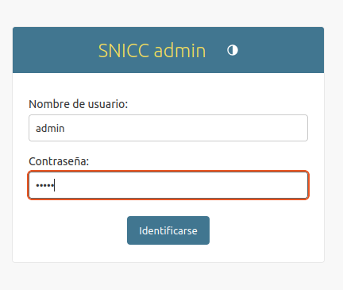
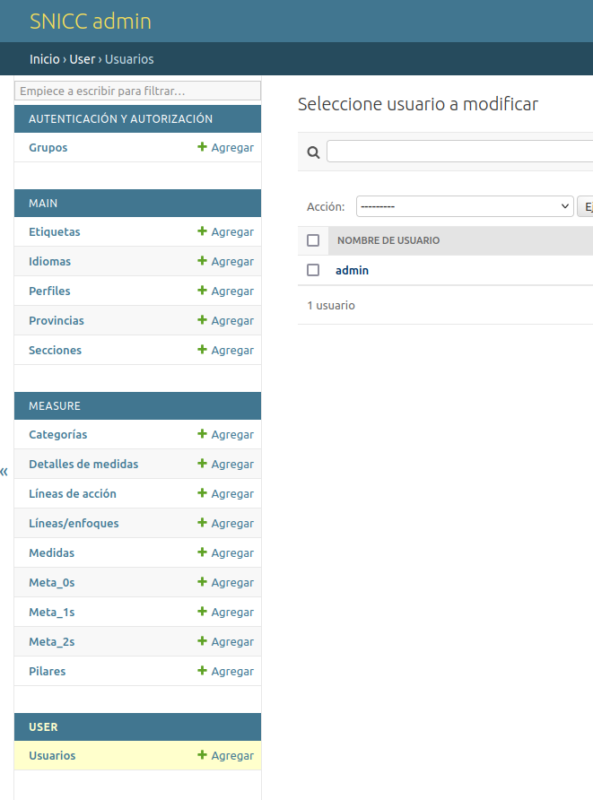

# SNICC Installation

## Prerequisites

### 1. docker

Install docker on your system : [https://docs.docker.com/get-started/get-docker/]

### 2. git 

Install git : [https://git-scm.com/downloads]

### 3. source code

Open a terminal and clone the source code

```
$ git clone https://github.com/laurent-braud/snicc.git

Clonage dans 'snicc'...
remote: Enumerating objects: 2157, done.
remote: Counting objects: 100% (12/12), done.
remote: Compressing objects: 100% (11/11), done.
remote: Total 2157 (delta 0), reused 2 (delta 0), pack-reused 2145 (from 1)
Réception d'objets: 100% (2157/2157), 13.93 Mio | 14.89 Mio/s, fait.
Résolution des deltas: 100% (1353/1353), fait.
```

## Run docker image

### 4. Enter the directory.

```
$ cd snicc
```

### 5. Edit .env 

Copy `dot.env` to `.env`. Edit `.env`, setting the host port to suit your needs.

* `HOST_PORT` : port of the server
* `EMAIL_HOST, EMAIL_PORT, EMAIL_HOST_USER, EMAIL_HOST_PASSWORD` : authentification to the smtp mail server. If `EMAIL_HOST` is not set, the server will not output email, so user login is not possible (admin login is still available).

### 6. Run the containers

This might take some time while docker is downloading and building containers.

```
$ docker compose up -d

✔ Network snicc_snicc       Created
✔ Container snicc-django-1  Started
✔ Container snicc-nginx-1   Started
```

### 7. Enter the main container.
```
$ docker compose exec django bash
```

### 8. Build static files
```
# python manage.py collectstatic

258 static files copied to '/code/static'.
```

### 9. Make migrations

```
# python manage.py makemigrations

Migrations for 'measure':
  measure/migrations/0001_initial.py
    + Create model CacheResponse
    + Create model Label
    + Create model Line
    + Create model LineCategory
    + Create model MeasureField
    + Create model Meta_0
    + Create model Pilar
    + Create model Action
    + Add field category to line
    + Create model Meta_1
    + Create model Meta_2
    + Create model Measure
Migrations for 'main':
  main/migrations/0001_initial.py
    + Create model Language
    + Create model Post
    + Create model PostCategory
    + Create model Profile
    + Create model Provincia
    + Create model Tag
    + Create model Media
    + Add field category to post
    + Create model PostCategoryVersion
    + Create model PostProfile
    + Create model PostVersion
  main/migrations/0002_initial.py
    + Add field user to postversion
    + Add field profile to postprofile
    + Add field tags to post
    ~ Alter unique_together for postprofile (1 constraint(s))
Migrations for 'user':
  user/migrations/0001_initial.py
    + Create model User
    + Create model EditorAccess
```

### 10. Apply migrations in the database.

```
# python manage.py migrate

Operations to perform:
  Apply all migrations: admin, auth, contenttypes, main, measure, sessions, user
Running migrations:
  Applying main.0001_initial... OK
  Applying contenttypes.0001_initial... OK
  Applying contenttypes.0002_remove_content_type_name... OK
  Applying auth.0001_initial... OK
  Applying auth.0002_alter_permission_name_max_length... OK
  Applying auth.0003_alter_user_email_max_length... OK
  Applying auth.0004_alter_user_username_opts... OK
  Applying auth.0005_alter_user_last_login_null... OK
  Applying auth.0006_require_contenttypes_0002... OK
  Applying auth.0007_alter_validators_add_error_messages... OK
  Applying auth.0008_alter_user_username_max_length... OK
  Applying auth.0009_alter_user_last_name_max_length... OK
  Applying auth.0010_alter_group_name_max_length... OK
  Applying auth.0011_update_proxy_permissions... OK
  Applying auth.0012_alter_user_first_name_max_length... OK
  Applying user.0001_initial... OK
  Applying admin.0001_initial... OK
  Applying admin.0002_logentry_remove_auto_add... OK
  Applying admin.0003_logentry_add_action_flag_choices... OK
  Applying main.0002_initial... OK
  Applying measure.0001_initial... OK
  Applying sessions.0001_initial... OK
```

### 11. Create a superuser

```
# python manage.py createsuperuser

Nombre de usuario: admin
Dirección de email: admin@example.com
Password: 
Password (again): 
Superuser created successfully.
```

### 12. Load initial metadata

The superuser (or any user with id 1) must exist to allow the loading of data.

```
# python manage.py loaddata main_medidas
```

### 13. Superuser access

Navigate to `<SITE>/admin/user/user/1/change/` and give the superuser full editor access ("Todos los idiomas", etc). Save the changes (_guardar_).





### 14. Setup users

Create a user via the admin or let him/her registrate through the regular user process.

* For the user to be a _editor_, go to `Editor Access` below. Configure the editing access as needed. The user will be able to edit post and/or measures at the `/editor/post/list` url.

  * `Idiomas` means the user will only be able to edit specific languages, or all if `Todos los idiomas` is checked
  * `Puede eliminar` means the user is able to delete unprotected posts
  * `Medidas` means the user can also edit measures (but not create new ones).

* For the user to be an _administrator_, check the `is_superuser` box. The user will be able to login to the `/admin/` interface and edit anything there. You might want to also give editor access to this user.
