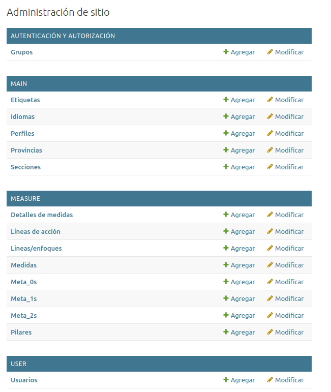
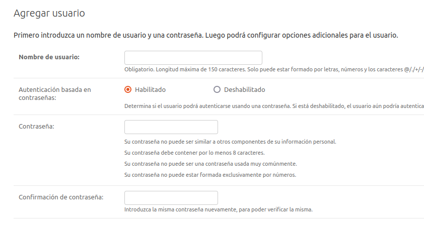
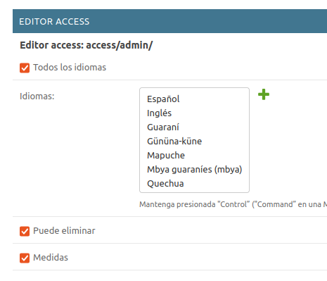
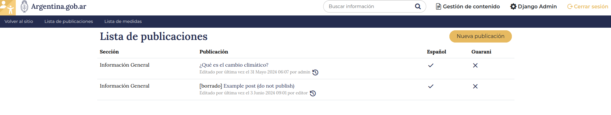
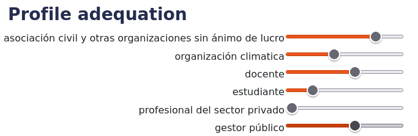
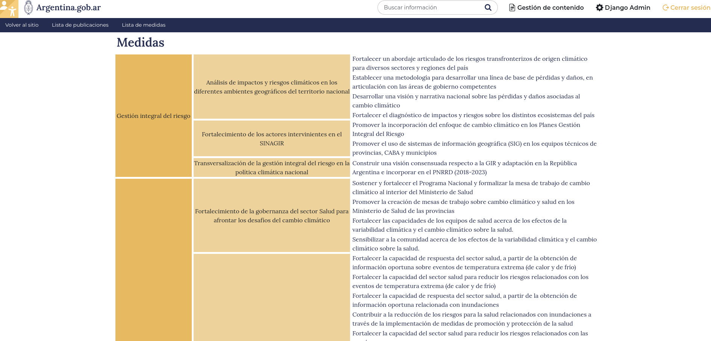
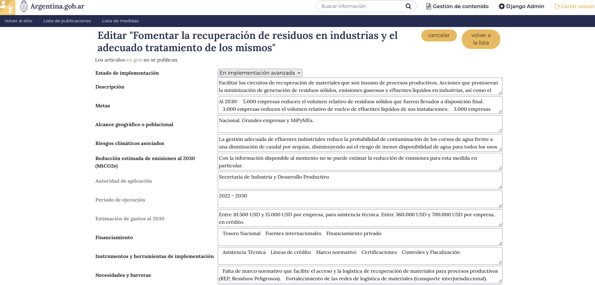

# SNICC User guide

In the following, `<SITE>` will denote the SNICC url, for instance `https://snicc.ecoclimasol.com/` for the development version.

## User management

Only the superusers and the staff users in the _full admin_ group are entilted to create new users.

The SNICC portal makes a distinction between _administrators_ and _writers_. 

* **Admins** are responsible for SNICC management, such as managing other users, administrating categories 
and creating new resources. All these operations take place at the `<SITE>/admin/` url (_Admin_ link).
* The actual text production is done by a **writer** and take place at the `<SITE>/dashboard/` url (_Gestión de contenido_).

A user can be both admin and writer.

The following section is only for admins :



### User creation

In the `Usuarios` panel, click on `Agregar usuario`. Fill the username and password, then on _Guardar y continuar editando_



### Writers

Fill the `Editor Access` part below.

* whether the user is allowed to post in a given category (checking _todas la secciones_ will override all categories)
* what language is the user entilted to (checking _todas la idiomas_ will override all languages)
* if the user is allowed to delete a post
* whether the user is allowed to modify measure (medidas) details.

Save the changes (_guardar_).



### Staff users

Click on `Es staff` checkbox, then select one of the groups.

* `full admin`s have access to all admin panels, including user creation / deletion
* `manager`s cannot edit users, but may add or change categories.

Save the changes (_guardar_).

## Post edition

This part is done by a writer in the dashboard.

Post editor is accessed by clicking on "Gestión de contenido" in the top-right or accessing `<SITE>/editor/post/list` url.



Writers entilted to write in the default language (spanish) can created a new article. 
Others can only perform translations on their languages.

### Post initialization

When creating a post the writer has to chose the adequation to all profiles. This is conceptualized by a 6-value ladder, zero being to the left and 5 to the right. If a new profile is added (in the admin), all existing posts will attribute a zero adequation to this profile by default.



The post must also be attributed a category to be displayed in and a title. The "slug" is the url of the post and may be ignored. It will then be set from the title.

### Markdown redaction

Posts are written in markdown, a lightweight formatting language which allows easier manipulation and translating. 
This user guide itself is written in markdown.
Most useful shortcuts are available via icons in the editor, and [more are available online](https://www.markdownguide.org/) if needed. 

A markdown cheat sheet would look like this :

```markdown
# heading 1 (title)
## heading 2 (section)
### heading 3 (subsection)

Itemize :
* item 1
* item 2

Write in **bold** and _italic_, add [links](argentina.gob.ar) and `code text`.

Insert a line below :
----------

> this is a citation block
```

A preview of the article is shown below the editing block. This preview may differ slightly from the final rendering of the post.

#### images

The portal manages images directly. Click on the button and upload any `jpg`, `png` or `svg` file. The resulting url is of the form `/media/<id>/image-name.extension`, where `<id>` is the post number, which means all images for a given post should have distinct names.

External images (i.e. not hosted in the portal) can be linked by the following syntax :
```markdown

```

#### html

For more flexibility, it is also possible to add html directly into the markdown code. For instance, there is a [markdown syntax for producing tables](https://www.markdownguide.org/extended-syntax/#tables), but it may be easier to rely on [html tables](https://www.w3schools.com/html/html_tables.asp).

Another use case would be for tweaking the size of images.

### Translations

The post editor is roughly the same for producing translations. The original text (in markdown format) is shown in the left panel to allow direct comparison and copy-paste some parts (images, for instance).

The original and translation are compared before save to check for the number of sections and images. This protection may be bypassed by unchecking the "check diff" button.

## Measures / Medidas

Measures / _medidas_ are created and activated through the administration site, and details can be filled in the writer's dashboard
by accredited users.

### Measure creation

Measures are created and activated in the admin site. Click on medidas to list existing or create a new one.

_Líneas, enfoques_ and _Líneas de acción_ may also be managed in the measure menu.

### Measure edition

Editing measure data is done in the editor dashboard, by clicking on _Lista de medidas_ in the top bar 
or accessing the `<SITE>/editor/measure/` url.
The page shows a list of medidas and the corresponding hierarchy of _Líneas/enfoques_ and _Líneas de acción_.



Clicking on a measure show the details. The fields in gray are currently inactive, i.e. they will not show
on the SNICC site.

Clicking on _editar_ allows the edition of each field. For admins, clicking on _admin_ goes back to the administration part.


